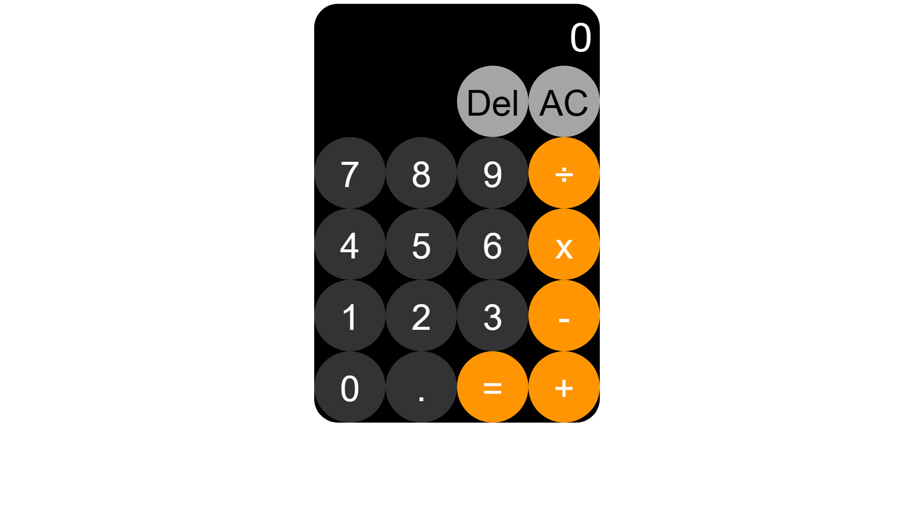

# Calc

This is the fifth project from [The Odin Project](https://www.theodinproject.com/lessons/foundations-calculator) curriculum — a calculator mostly built in Javascript.
## Preview

## Usage Guide

You can use the calculator either by **clicking the buttons** on screen or using your **keyboard**:

- **Numbers (0–9)** → Enter digits
- **`.` (dot)** → Enter decimals
- **+ – × ÷** → Basic arithmetic operators
- **Enter** or **=** → Calculate result
- **a** → Clear all (**AC**)
- **Delete** or **Backspace** → Delete last digit (**Del**)

## Skills Learned

### JavaScript Basics

- Variables and Operators
- Data Types and Conditionals
- JavaScript Developer Tools
- Function Basics
- Understanding Errors
- DOM Manipulation and Events
- Object Basics
